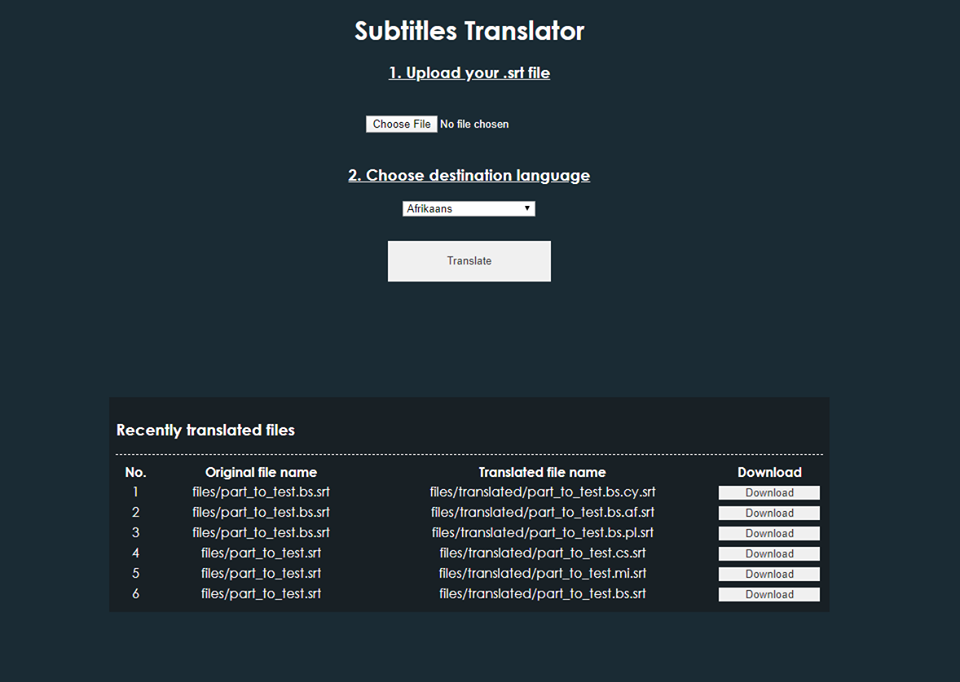
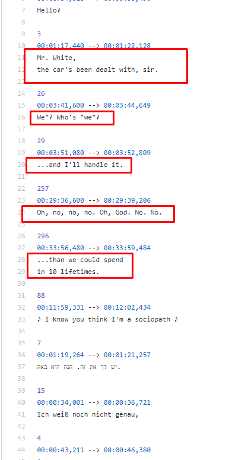
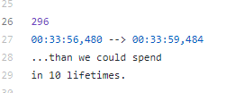

# Dokumentacja
## O aplikacji
Aplikacją w projekcie jest translator napisów. Aplikacja pozwala użytkownikowi dodać własny plik srt i przetłumaczyć je z dowolnego języka (w jednym pliku może być nawet kilka różnych języków - aplikacja je rozpozna) na inny dowolny język.

Działanie aplikacji opiera się na wrzuceniu przez użytkownika pliku z napisami i określeniu języka docelowego. Po wybraniu przycisku "Translate" plik trafia na dysk w App Service. Tam jest otwierany i odczytywany linijka po linijce.

Pliki srt posiadają numer grupy i zakres czasu podczas którego napisy będą wyświetlane na ekranie. Następnie dodawana jest linijka odstępu i algorytm zapętlający cały proces. Algorytm odczytuje za pomocą generatora plik linijka po linijce, jeśli trafi na tekst, wtedy zapisuje do momentu aż nie trafi na pustą linię. Jeśli w kolejnych liniach znajduje się tekst, wtedy są one łączone i wysyłane do tłumaczenia (jeśli w następnej nie ma tekstu, wtedy wysyła tylko tę jedną, do pojawienia się linii bez tekstu. Linijkę bez tekstu zapisuje do nowego pliku).
#### Przykład:

Linijki 26 i 27 zapisują się bez zmieniania do nowego pliku. Linijki 28 i 29 zostają przetłumaczone i zapisane do nowego pliku.
Po przetłumaczeniu na dysku w App Service tworzy się nowy plik. Następnie napisy są wysyłane do konta magazynu i usuwane z dysku w App Service. W bazie danych pojawiają się nazwy plików i ich lokalizacje w Storage. Przy pobieraniu przez użytkownika, nazwa pliku jest wyszukiwana w Storage, plik jest ładowany do pamięci komputera i wysyłany do użytkownika.

## Koszty
Do wdrożenia aplikacji wykorzystano następujące usługi chmurowe Azure: 
* Azure App Service
* Azure Database for PostgreSQL
* Cognitive Service (TextTranslation)
* Storage Account

### Plan i koszty usługi Azure App Service

### Plan i koszty usługi Azure Database for PostreSQL

### Plan i koszty usługi Cognitive Service (TextTranslation)

### Plan i koszty usługi Storage Account

