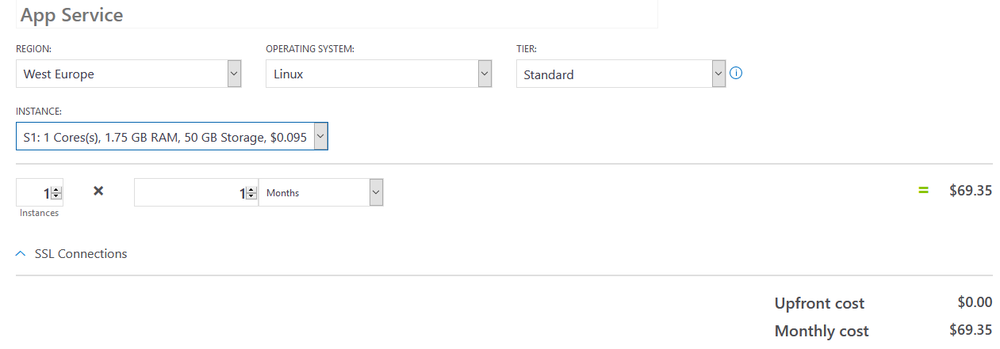
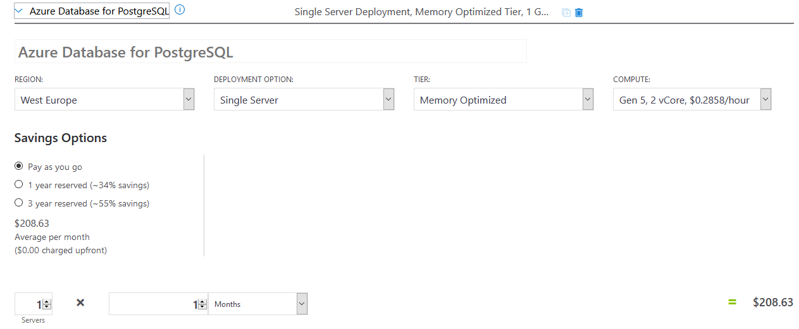
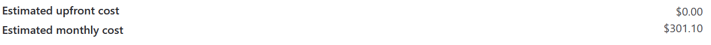

# Dokumentacja
## O aplikacji
Aplikacją w projekcie jest translator napisów. Aplikacja pozwala użytkownikowi dodać własny plik z napisami w 
formacie .srt i przetłumaczyć z dowolnego języka (w jednym pliku może być nawet kilka różnych języków - 
aplikacja je rozpozna) na język wybrany przez użytkownika.

#### Upload
Użytkownik uploaduje plik z napisami na serwer i określa język docelowy. Po kliknięciu przycisku "Translate" 
plik tymczasowo trafia do lokalnego magazynu danych w App Service. Tam do nazwy oryginalnego pliku jest doklejany timestamp, 
aby zapobiec błędom, gdy więcej użytkowników wgrywa ten sam plik w krótkich odstępach czasu. 
Tworzona jest również nazwa nowego pliku (nazwa oryginalnego pliku + kod języka + .srt).
Oryginalny plik jest wgrywany do kontenera na Koncie Magazynu do katalogu "original", a jego lokalna kopia przekazywana do tłumaczenia.
Po zakończeniu procesu nowy plik jest także uploadowany do kontenera, ale tym razem do katalogu "translated". 
Ten przetłumaczony również jest zapisywany tymczasowo lokalnie. Na koniec obie kopie plików są usuwane, a ich nazwy zapisywane w bazie danych.

#### Zasada działania
Zawartość pliku .srt składa się z czterech części:
* numer grupy,
* zakres czasu podczas którego napisy będą wyświetlane na ekranie,
* napisy,
* pusta linia oznaczająca koniec grupy.

Na początku jest określane kodowanie znaków w pliku w celu zmniejszenia ryzyka pojawienia się błędu. Następnie plik jest odczytywany linia po linii.
Najpierw jest odczytywana pierwsza linia, która zawiera numer grupy. Następnie jest uruchamiana nieskończona pętla while.    

W każdej iteracji działa kolejna pętla while, która odczytuje każdą z grup w pliku. Działa ona dopóki nie napotka znaku nowej linii.
W każdej iteracji za pomocą wyrażenia regularnego jest sprawdzane, czy w aktualnej linii znajduje się tekst.
Jeśli tak jest, to dodaje go do listy, w przeciwnym wypadku linia jest "wyrzucana" i zapisywana w nowym pliku jako niezmieniona.
W celu zachowania spójności tłumaczenia każda kolejna linia zawierająca tekst w obrębie jednej grupy jest dodawana do listy. Jeśli algorytm napotka znak nowej linii, to wewnętrzna pętla while zostaje przerwana.    

W kolejnym kroku sprawdzane jest, czy lista zawiera tekst, jeśli tak jest, to jest on przekazywany do funkcji, 
która ma za zadanie odpytać usługę translatora za pomocą metody POST protokołu HTTP. 
W ciele zapytania jest przekazywana zawartość listy. Język źródłowy tekstu jest automatycznie wykrywany przez usługę. 
W odpowiedzi serwer zwraca przetłumaczony tekst (na język żądany przez użytkownika), który zostaje również "wyrzucony" z funkcji i 
zapisany do nowego pliku. Na koniec iteracji głównej pętli wyrzucana jest pusta linia, czyści się lista zawierająca napisy oraz odczytywana jest kolejna linijka pliku.
Główna pętla działa aż do napotkania wyjątku StopIteration, który w tym przypadku jest równoznaczy z końcem pliku. 
Na koniec działania algorytmu tekst, który pozostał jest tłumaczony i również zapisywany w nowym pliku.
 

#### Przykład

Linijki 25, 26 i 27 zapisują się bez zmieniania. Linijki 28 i 29 zostają przetłumaczone i zapisane do nowego pliku.

#### Download
Przy pobieraniu przez użytkownika, nazwa pliku zapisana w bazie jest wyszukiwana w Storage, plik jest ładowany do pamięci komputera i 
wysyłany do użytkownika.

## Koszty
Do wdrożenia aplikacji wykorzystano następujące usługi chmurowe Azure: 
* Azure App Service
* Azure Database for PostgreSQL
* Cognitive Service (TextTranslation)
* Storage Account

#### Wyliczone koszty są dość wysokie, aplikację równie dobrze można postawić na darmowym planie F1 lub tańszym B1 (ze skalowaniem ręcznym) w App Service oraz bazą danych tańszą o połowę - jednak dla wszystkich usług wybraliśmy takie opcje, które umożliwiają skalowanie automatyczne i poradzą sobie z obsłużeniem 10.000 użytkowników jednocześnie.
#### Plan i koszty usługi Azure App Service
Przy wybranym planie usługi App Service w lokalizacji West Europe, System operacyjny Linux, plan standardowy S1 z automatycznym skalowaniem - koszty prezentują się następująco (69.35  USD).

#### Plan i koszty usługi Azure Database for PostreSQL
Najwięcej miesięcznych kosztów generuje baza danych (208.63 USD) przy planie Memory Optimized uwzględniającym skalowanie w razie potrzeby. Lokalizacja West Europe, plan miesięczny "Pay as you go".

#### Plan i koszty usługi Cognitive Service (TextTranslation)
Usługa w wersji free uwzględnia miesięcznie do 2.000.000 przetłumaczonych znaków.

#### Plan i koszty usługi Storage Account
Konta magazynu generują szacowane miesięczne koszty w wysokości 20.80 USD na miesięcznym planie "Pay as you go" w lokalizacji East US.

#### Szacowany miesięczne koszty wszystkich wykorzystanych usług
Oszacowany miesięczny koszt utrzymania postawionej aplikacji (w wybranym planie z możliwością skalowania) - wszystkich usług wraz z dodatkami do poszczególnych z nich - dobre miesięczne koszty na przykład za SSL wynosi 301.10 USD.

## Testy
